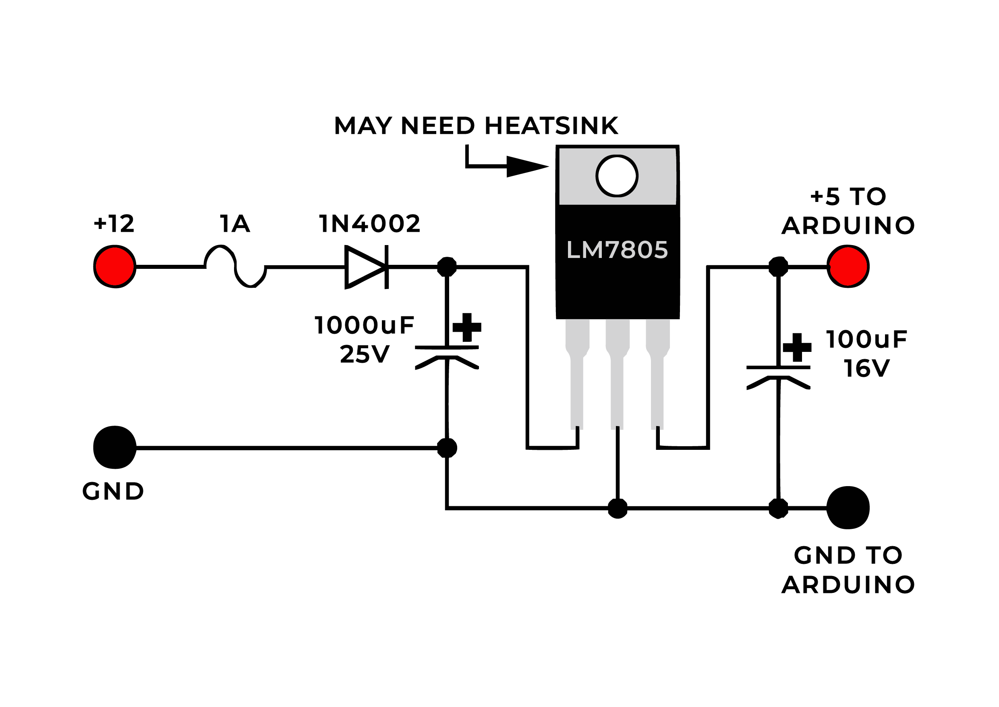

# How to use Arduino in automotive setting with display

## Power supply to safely power an Arduino from 12V lead acid battery

The purpose of the parts in the power supply:

- 1A Fuse -  protect the circuit from battery failure
- 1N4002 diode - keeps large current drain spikes from getting to the Arduino and crashing it
- 1000uF capacitor - adds capacitance to the circuit
- 7805 voltage regulator - provides stable 5 volts and electrical noise rejection
- 100uF capacitor - extra stability for 7805

The fuse, diode and a large capacitor are necessary to keep the electrical noise to the minimum which can crash the running software and even damage the AVR chip.

## Links
- Some links [Link name](https://www./ "Link")